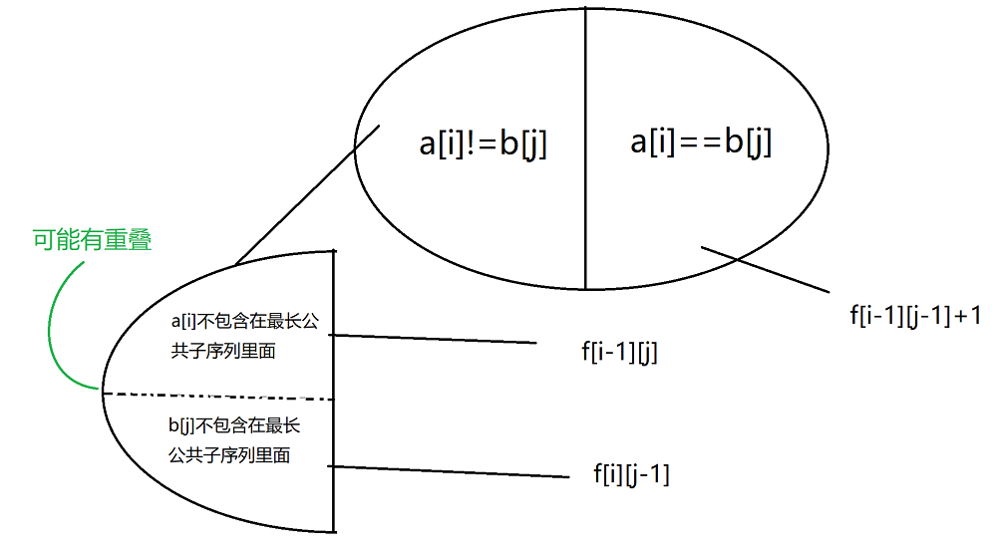
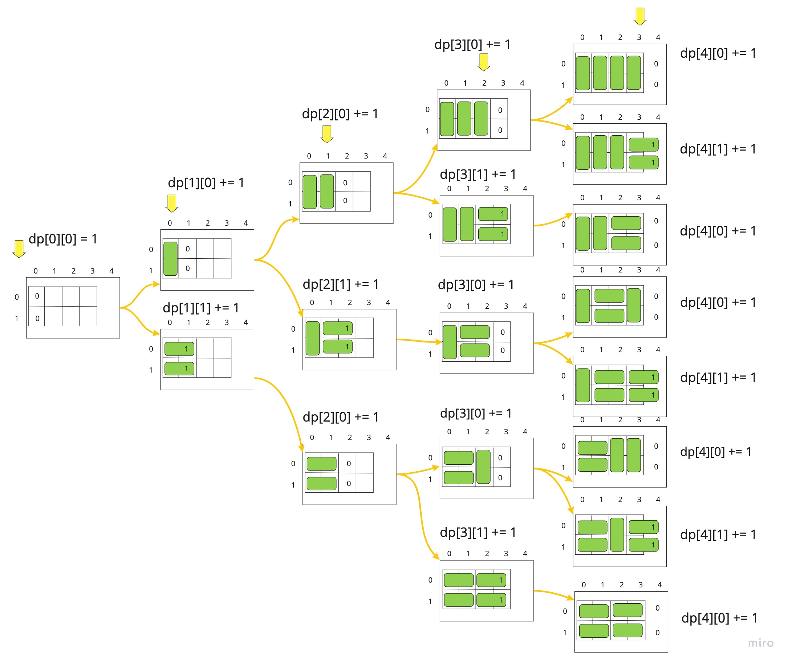

### Trie

1. don't create new node when there is already a node.

### Union Find

1. in isSameSet(), use findParent(n1) == findParent(n2), don't use n1.parent == n2.parent.

### Heap

1. comparing left, right, and parent to find the min index

### Graph

1. BFS: when neighbors enter the q, add them to the visited list to prevent duplicate

2. Kruskal: use edges count >= n - 1 to verify all nodes has been connected, it's wrong by counting added nodes bc it
   could be several unconnected parts.

3. dijkstra:
    1. 拿出一条最短边，看它的终点是不是已经在set中，如果在就跳过
    2. 用这个终点来更新终点所连接的点的距离，如发现有更新就把它和原点形成的边加入到q中

### DP

1. A897 最长公共子序列 

2. A291 蒙德里安的梦想 